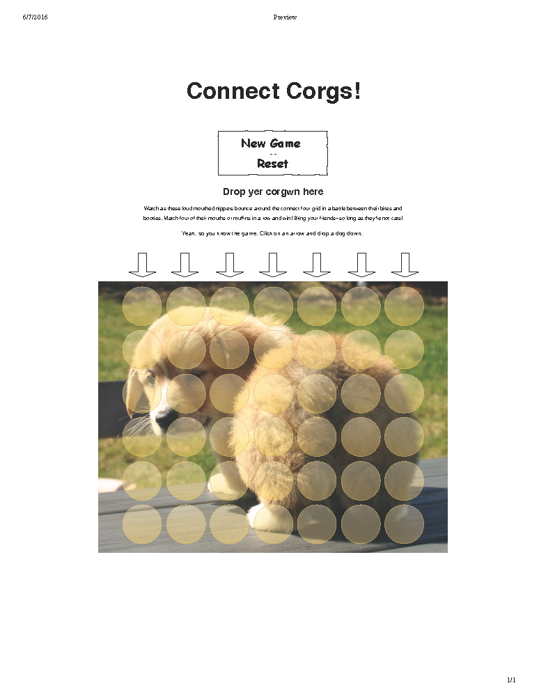

# connect-corgs
First project for GA

Connect Corgs!

You got it. I’m making connect four with pictures of corgis. These oblong dogs will battle it out at their rounds ends: their foxy faces and bouncy butts.

That’s the only goal, initially. If I can figure out how to make the connect four part work well, and I’m feeling ambitious, then I hope to add features like having the user choose the size of the grid (between three and nine in each direction—maybe less to keep it reasonably responsive) and choosing the number of connected corgs (also between three and nine). Ultimately, I’d like it to look like the images are falling into place, fading in and out as they pass each hole. Maybe the could randomly rotate too. 

At first, it would be one corgi’s butt and another corgi’s face that would duel, but I would like to have arrays of images of different color corgwn (the plural of corgis if you speak Welsh, the dog’s indigenous language) that would duke it out. I would even consider adding inferior animals like cats or c0derz. 

Before I add the pseudocode, why is my pdf pink? There's no such thing as a pink corgi!

Pseudocode

When I first code the game, I will create a static grid using a table in html. If I find success with my connect four algorithm, I will create the table dynamically using jquery, but I suspect the algorithm will be the most difficult part to implement, so the rest of this discussion will be about a regular game of connect four with a static grid in an html table.

- Create a grid in html
- Create a class for each player to populate the cell with either a corgi face or butt
- Create a message box to indicate which player starts and whose turn it is
    - Create a function that randomly chooses heads or tails (but we all know many corgis don’t have tails)
- Create a function that serves as the corgi drop off (check the arrows at the top of the mock-up). When a player clicks directly above (not sure if an arrow will really be there) or on a column, that will be where the corgi will fall.
    - Upon clicking a column, the function will check what the highest populated position is and add the player’s (by class) corgi to the row in the column directly above the top corgi already in the column.
    - If there is no corgi played in that column, the corgi will fall to the bottom or the first row
    - If the column is full, a notification will appear in the message box, and nothing will happen in the game
    - Make the corgi image fadeIn to whatever cell is ultimately chosen
- Create a function that will track which player’s turn it is either by using a boolean expression or checking against even/odd numbers with an if statement
- Watch for patterns!
    - Event listeners and other stuff. I’m not sure how I’ll do this yet, but it will be the hardest part, and I suspect I’ll credit a person, site or several of each, but I’ll take a stab about how it might work
        - Once a corgi falls, it will trigger an event listener that will sniff around to see what other corgs are hanging out near him. He will have to look at each of the cells that directly surround him including those connected diagonally
            - To find the diagonal cells he may have to move twice
        - Once he sniffs a neighboring cell, he will know if it is another corgi like him or if he’s just sniffing some other corgi’s butt.
            - If he’s sniffing butt, then he’ll just stop and go find another corg to sniff (It’s a game, it isn’t supposed to be realistic)
        - If he finds a corgi like him, then he will have to keep going in the same and directly opposite direction via a loop.
            - This is probably where I’m going to need the most help (like if he goes in one direction, then tracks back, I’ll need to make sure that each cell is only counted once—maybe it will create an array that will check for duplicates—each cell could be given an id based on its position in the table)
        - Every time a corgi is dropped, it will have to trigger this pattern, which will begin running in a clockwise motion and will go in the opposite direction once it hits an empty cell, the end of the grid, or a cell populated by the opponent.
            - The function will only have to track 180 degrees because it will go in the other direction, but I will test 360 degrees in case.
            - I’ll use some jQuery animation to show when it’s looking for matches each time it finds a neighboring match (kind of like as console.log, and it might look nice for players)
- If four cells in a line match, someone wins

After writing the pseudocode, I suspect I might be spending most of my time to get the connect four game going, but if I have enough, I will try to generate the table with jQuery, giving each cell an appropriate id and class (or maybe just two classes will be enough to determine a unique cell when comparing the line). I’m guessing by this time, I’ll want to focus on making it look nicer if I have anytime to spare.

--------------------------------------------

Update:

There's still so much that I want to do. If there's a bit of time, then I'll try to make it look a little nicer and add more animation.

With much help from instructors, classmates and the interwebs (see comments in code for more specific attribution, but thanks a lot Jason, for really helping with the overall structure and Bobby for explaining the initial tasks), I've been able to create a static grid, using a table that I manually created in HTML to resemble a connect four board that has corgis battle to win by taking four consecutive spots in any one of horizontal (along the x-axis or y = a constant), vertical (along y or x = a constant) or diagonal (x = y; x = -y) directions.

I borrowed heavily from an online algorithm to generate my code to test for a winner. I could understand it a bit better and try to impliment it organically in the future. I imagine that I will rewrite this game after the class when I am updating my portfolio to help me fully grasp that evaluation and to add features and make the game look nicer. Perhaps, I'll be doing some of that while still in class.

Features to add:

- Make the board dynamic with a prompt. I feel like it would be incredibly useful to learn how to take the users’ input for what kind of grid they would like to see and have the game  dynamically create the html table as well as the appropriate css and javascript. For example, if a user responded to prompts indicating a row that’s nine places, a column that’s eight places and that requires five cells to connect before winning, then the script would generate the board, update the board’s multidimensional array and updated the win algorithm to match. Actually, the CSS could just be a little more responsive, and it wouldn’t need to be dynamically generated.
- Once a column is full, I need to unbind clicking on the column, or at least, stop the change turn function for just that column. So far, I have only been able to stop it entirely, effectively ending the game. That doesn’t work.
- The game doesn’t end. It needs to do that after someone wins. See reset button discussion below re initialization function. That would probably help to stop everything too.
- The reset button is currently using reload function. I would like to use an initialization function that resets all global variables and removes classes while also creating a temporary class that pops the dogs off to go herd sheep. Can’t keep corgis in boxes for too long.
- More animation and letting users choose other options. Though seriously, who doesn’t want to see a puppy’s face or a heart shaped but that says I <3 u. I mean, the “I” is even shaped like a bone. Also, I’m comfortable with my maturity, among other things.
- Touch controls and full responsiveness so that the game could be played on phones/tablets.
- It would be nice if the circle didn’t disappear when a dog falls. Maybe the classes could   be layered or the circle could fade out while the corgi chip fell into place.

That’s it for now. I’m going to add a farm background with sheep. I want to find a gif that moves and makes my site look that much cooler, but relevance is important and I suspect that I won’t find an appropriate gif or movie file in time.
